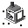
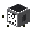
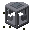
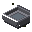

# Machine

IndustrialCraft: Evolution의 기계 모듈입니다. 연료를 소모해 **회전 동력**(토크·각속도)을 내는 엔진과, 그 동력을 1:1로 중계하는 Dynamo부터 시작합니다. 또한 **리저버**(유체 저장)·**유체 파이프**로 바닐라 유체를 다룰 수 있습니다.

Machine 전용 제작은 **기계 제작대**에서만 가능합니다. Material 모듈이 있으면 등급별 석탄류 연료 값·태그를 그대로 활용합니다. Material이 없어도 바닐라 `#furnace_minecart_fuel`(석탄·숯)로 동작합니다.

아이템 창 썸네일은 **3D 블록 모델**(엔진·Dynamo는 샤프트 프리뷰 composite 포함)을 쓰고, 조속기 부속만 **2D 아이템** 텍스처입니다.

## 목차

**콘텐츠**

| | 이름 | ID |
|---|------|-----|
| 1 | [기계 제작대](#1-기계-제작대) | `machine:machine_crafting_table` |
| 2 | [화로 엔진](#2-화로-엔진) | `machine:furnace_engine` |
| 3 | [조속기 부속](#3-조속기-부속) | `machine:governor_accessory` |
| 4 | [Dynamo](#4-dynamo) | `machine:dynamo` |
| 5 | [리저버](#5-리저버) | `machine:reservoir` |
| 6 | [빗물받이](#6-빗물받이) | `machine:rain_collector` |
| 7 | [유체 파이프](#7-유체-파이프) | `machine:fluid_pipe` |

**공통**

- [샤프트 시각 회전](#샤프트-시각-회전-shaftvisuals) — 엔진·Dynamo BER 공용
- [등록 콘텐츠](#등록-콘텐츠) — ID 일람

---

## 1. 기계 제작대

 · **블록** · Machine Crafting Table

Machine 모듈 전용 3×3 제작대입니다. `machine:machine_crafting` 타입 레시피만 매칭하며, 바닐라 제작은 할 수 없습니다. 바닐라 제작대와 같이 **레시피북**(녹색 책)으로 빠른 배치가 가능합니다.

| 항목 | 값 |
|------|-----|
| 블록 | `machine:machine_crafting_table` |
| 레시피 타입 | `machine:machine_crafting` |
| 아이템 모델 | `machine:block/machine_crafting_table` 3D (`gui_light: side`) |

### 제작 (바닐라 제작대)

| | | | | |
|:---:|:---:|:---:|:---:|:---:|
|  |  |  | | |
|  |  |  | → |  × 1 |
|  |  |  | | |

우클릭으로 GUI를 엽니다. 레이아웃은 바닐라 제작대와 같습니다. Machine 레시피(기계 제작대·화로 엔진·Dynamo·조속기 부속 등)는 월드 시작 시 레시피북에 해금됩니다.

---

## 2. 화로 엔진

 · **블록** · Furnace Engine

연료를 태워 플라이휠을 가속하고, 샤프트로 회전 동력을 출력하는 기초 엔진입니다. **조속기 부속**을 장착하면 GUI에서 출력을 1~100%로 조절할 수 있습니다.

| 항목 | 값 |
|------|-----|
| 블록 | `machine:furnace_engine` |
| 연료 슬롯 | 1칸 |
| 조속기 슬롯 | 1칸 (`machine:governor_accessory`, 스택 1) |
| 연료 태그 | `#minecraft:furnace_minecart_fuel` |
| 최대 연료 버퍼 | 32000틱 |
| 정격 토크 | 4 Nm |
| 정격 각속도 | 256 rad/s |
| 정격 출력 | 1024 W (토크 × 각속도) |
| 아이템 모델 | composite: 블록 3D + `furnace_engine_shaft_preview` |

우클릭으로 GUI를 엽니다. 연료 게이지(불꽃)·현재 토크·각속도·출력을 확인할 수 있습니다. 조속기가 있으면 출력 % 슬라이더가 추가로 표시됩니다.

### 제작 (기계 제작대)

| | | | | |
|:---:|:---:|:---:|:---:|:---:|
|  |  |  | | |
|  |  |  | → |  × 1 |
|  |  |  | | |

바닐라 제작대에서는 만들 수 없습니다.

### 사용법

1. 화로 엔진을 설치합니다. 샤프트(톱니)는 설치 직후 **플레이어를 향한 면**(toward player)에 있습니다.
2. GUI에 석탄·숯 등 허용 연료를 넣습니다.
3. 연소가 시작되면 블록이 점화(`LIT`)되고, 배기구에서 연기가 나며 샤프트가 회전합니다.
4. 연료가 끊겨도 플라이휠이 서서히 감속하므로 출력이 바로 0이 되지 않습니다.
5. (선택) 조속기 부속을 왼쪽 슬롯에 넣으면 출력을 1~100%로 조절할 수 있습니다. 자세한 내용은 [3. 조속기 부속](#3-조속기-부속)을 참고하세요.

곡괭이로 캘 수 있으며, 파괴 시 내부 연료·조속기 아이템이 드롭됩니다.

### 연료 시간

용광로 연소 시간을 **화로 광차** 기준으로 환산합니다. 석탄(용광로 1600틱)이 화로 광차 3600틱에 대응합니다.

```
엔진 연소 틱 = 용광로 연소 틱 × 3600 / 1600
```

예시 (Material 연료 등급 기준, 용광로 연소 → 엔진 연소, 스로틀 100%):

| | 연료 | 용광로 | 화로 엔진 |
|---|------|--------|-----------|
|  | 이탄 | 400틱 | 900틱 (45초) |
|  | 갈탄 | 800틱 | 1800틱 (90초) |
|  | 아역청탄 | 1200틱 | 2700틱 (135초) |
|  | 숯 | 1400틱 | 3150틱 (157.5초) |
|  | 역청탄(석탄) | 1600틱 | 3600틱 (180초) |
|  | 무연탄 | 2000틱 | 4500틱 (225초) |

Material이 없으면 바닐라 석탄·숯만 사용되며, 각각의 용광로 연소 시간에 같은 비율이 적용됩니다. 현재 잔여 연료 + 추가분이 32000틱을 넘으면 새 연료를 소비하지 않습니다.

조속기로 출력을 낮추면 **적용 스로틀** 비율만큼 연소가 느려져 같은 연료로 더 오래 갑니다 (예: 50%면 약 2배).

### 동력 출력

`PowerSource` 인터페이스로 토크·각속도를 제공합니다. 실제 값은 **스핀 계수** \(s\)(0~1)와 **적용 스로틀** \(t\)(조속기 없을 때 1)에 따릅니다.

```
τ = 4 × s × √t
ω = 256 × s × √t
P = τ × ω  ∝  s² × t
```

풀스핀·스로틀 100% 기준 1024 W이며, 스로틀 %에 **출력(W)이 선형**으로 맞춰집니다.

| 상태 | 토크 | 각속도 | 출력 |
|------|------|--------|------|
| 정지 | 0 Nm | 0 rad/s | 0 W |
| 정격(s=1, t=1) | 4 Nm | 256 rad/s | 1024 W |
| 예: s=1, t=0.5 | ≈2.83 Nm | ≈181 rad/s | 512 W |

- 연소 중이고 적용 스로틀 \(t > 0\): 스핀 계수가 틱당 +0.05 (약 1초면 정격)
- 소화 후: 스핀 계수가 틱당 −0.0125 (약 4초면 정지)
- 슬라이더로 바꾼 **목표 스로틀**은 즉시 반영되고, **적용 스로틀**은 틱당 ±0.04로 따라갑니다 (0↔100% 약 1.25초)
- GUI의 토크/ω/W는 적용 스로틀 기준, % 라벨은 목표 스로틀
- 샤프트 **시각 회전**만 아래 로그 스케일을 따름 (`ShaftVisuals`; 입력 ω는 `256 × s × √t`) — [공통 · 샤프트 시각 회전](#샤프트-시각-회전-shaftvisuals)

샤프트 네트워크·다른 기계는 `PowerSource`만 조회하면 되며, 연료·인벤토리 로직에 의존하지 않습니다.

### 시각 효과

- 점화 시 배기구에서 캠프파이어 연기 파티클
- 화로와 같은 타는 소리(`FURNACE_FIRE_CRACKLE`)
- 클라이언트 BER로 샤프트·톱니(`shaft_gear`) 메시가 회전

`shaft_gear`는 엔진·Dynamo 공용 렌더 전용 아이템이며, 크리에이티브 탭에는 올리지 않습니다.

---

## 3. 조속기 부속

 · **아이템** · Governor Accessory

화로 엔진 전용 옵션 아이템입니다. 엔진 GUI 왼쪽 슬롯에 넣으면 **출력 1~100%**를 조절할 수 있고, 출력을 낮출수록 연료가 더 오래갑니다.

| 항목 | 값 |
|------|-----|
| 아이템 | `machine:governor_accessory` |
| 장착 | 화로 엔진 조속기 슬롯 (스택 1) |
| 조절 범위 | **1~100%** (0% 불가 — 연료가 동결되지 않도록) |
| 목표→적용 | 선형 램프, 틱당 0.04 (전 구간 약 1.25초) |
| 아이템 모델 | `machine:item/governor_accessory` 2D (`layer0`) |
| 크리에이티브 탭 | 기능 블록 |

조속기가 **없으면** 엔진은 항상 스로틀 100%로 동작합니다. 장착을 해제하면 목표가 즉시 100%가 되고, 적용 스로틀만 램프를 거쳐 복귀합니다.

### 제작 (기계 제작대)

| | | | | |
|:---:|:---:|:---:|:---:|:---:|
| |  | | | |
|  |  |  | → |  × 1 |
| |  | | | |

바닐라 제작대에서는 만들 수 없습니다.

### 상호작용 요약

1. 화로 엔진 GUI에서 **연료 슬롯 왼쪽**에 조속기 부속을 넣습니다.
2. 하단에 슬라이더와 `출력: N%` 라벨이 나타납니다. 드래그/클릭으로 목표 %를 바꿉니다.
3. 토크·각속도·출력 수치는 **적용 스로틀**에 맞춰 서서히 변합니다.
4. 연소 소모율 = 적용 스로틀이므로, 낮은 %일수록 같은 연료로 더 오래 돌아갑니다.
5. 조속기를 빼면 슬라이더가 사라지고 엔진은 100%로 복귀합니다. Shift+클릭으로 슬롯 ↔ 인벤토리 이동이 가능합니다.

Dynamo 등 다운스트림은 엔진이 내는 τ/ω만 받으므로, 조속기 조절이 체인 출력에 그대로 반영됩니다.

---

## 4. Dynamo

 · **블록** · Dynamo

출력 축을 입력으로 받아 **토크·각속도를 1:1**로 반대쪽 출력 축에 넘기는 중계기입니다. I/O가 아닌 네 면에 실시간 토크 / 각속도 / 출력을 LCD 스타일로 표시합니다.

| 항목 | 값 |
|------|-----|
| 블록 | `machine:dynamo` |
| I/O | `FACING` = 출력, 반대면 = 입력 |
| 중계 | 입력 = 출력 (토크·ω 동일) |
| 표시 | 비-I/O 4면 Nm / rad/s / W |
| 아이템 모델 | composite: 블록 3D + `dynamo_shaft_preview` |

### 제작 (기계 제작대)

| | | | | |
|:---:|:---:|:---:|:---:|:---:|
|  |  |  | | |
|  |  |  | → |  × 1 |
|  |  |  | | |

바닐라 제작대에서는 만들 수 없습니다.

### 사용법

1. 앞단 기계의 **출력 축을 보고** 설치합니다. 시선 쪽 = 입력, 등 뒤 = 출력.
2. 예: 엔진 축이 북쪽이면, 엔진 북쪽에서 엔진(남쪽)을 보고 Dynamo를 놓습니다 → 입력 남 / 출력 북.
3. 체인도 동일: 앞 Dynamo의 출력 축을 보고 다음 Dynamo를 설치합니다.
4. 연결되면 비-I/O 네 면에 같은 수치가 표시되고, 출력 축 톱니가 입력 ω에 맞춰 돕니다.

출력 축은 이웃 Dynamo 입력 베어링까지 닿도록 길게 빠져 있습니다. 입력은 본체 안쪽 오목 베어링입니다.

시각 회전 스케일은 화로 엔진과 동일합니다 → [공통 · 샤프트 시각 회전](#샤프트-시각-회전-shaftvisuals)

---

## 5. 리저버

 · **블록** · Reservoir

바닐라 유체를 최대 **64 FU**(내부 **64 000 mB**, 1 FU = 1000 mB = 1 버킷)까지 저장하는 탱크입니다. 단일 유체만 보관합니다. GUI에는 **FU**만 표시합니다(탱크는 라인 PU를 보관하지 않음). 외관은 **철제 프레임 + 유리면 + 6면 파이프 플랜지**이며, 월드 수위는 **8단계**로만 보이며 단계가 바뀔 때만 클라에 동기화합니다.

| 항목 | 값 |
|------|-----|
| 블록 | `machine:reservoir` |
| 용량 | 64 000 mB (64 FU) |
| GUI | 왼쪽 게이지 + 중앙 버킷 슬롯 1칸 (게이지 아래 라벨) |
| GUI 슬롯 | 버킷 1칸 — 주입 시 +1000 mB |
| 월드 수위 | 8단계 — 단계 변경 시만 클라 동기화 |
| 디버그 | Reservoir GUI 오픈 시 서버/클라 진단 로그 1회 (`ReservoirVisual GUI-open`) |
| 출력 면 | 하단(`DOWN`)만 — 압력 구동 (`FluidTransfer`, 낙하 시 운반 PU +1) |
| 입력 면 | 상·북·서·동·남 — 파이프 자동 주입 가능 |
| 유압 | **수신 게이트 = 0 PU**. 탱크에는 라인 PU를 쌓지 않음. 파이프끼리 유량 분배(`수량 ∝ PU`)에는 참여하지 않음 |
| 아이템 모델 | `machine:block/reservoir` 3D |

### 제작 (기계 제작대)

| | | | | |
|:---:|:---:|:---:|:---:|:---:|
|  |  |  | | |
|  |  |  | → |  × 1 |
|  |  |  | | |

### 사용법

1. 우클릭으로 GUI를 엽니다.
2. 채워진 버킷을 슬롯에 넣으면 1 FU가 **0 PU**로 채워지고 빈 버킷이 남습니다.
3. 아래에 파이프를 두면 하단으로 유체가 나가고, 낙하 구간에 **+1 PU**가 실립니다.
4. (선택) 상단에 [6. 빗물받이](#6-빗물받이)를 올리면 비가 올 때 물을 모읍니다.

---

## 6. 빗물받이

 · **블록** · Rain Collector

리저버 **바로 위**에만 설치할 수 있는 선택형 수집 블록입니다. 하늘이 열려 있고 비가 오면 아래 리저버에 물을 채웁니다. 리저버에 기본 장착되지는 않습니다.

| 항목 | 값 |
|------|-----|
| 블록 | `machine:rain_collector` |
| 설치 | 바로 아래가 `machine:reservoir`일 때만 (리저버 제거 시 함께 파괴) |
| 수집 조건 | `isRainingAt(pos.above())` — 고체 블록 자체 칸은 높이맵에 막혀 항상 실패하므로 **한 칸 위 공기**에서 판정 |
| 수집량 | **25 mB/틱** (0.5 FU/s, 64 FU 만충 ≈ 128초) |
| 유체 | 물만 — 비어 있거나 이미 물일 때 주입 (다른 유체면 무시) |
| 압력 | 0 PU (버킷 주입과 동일) |
| 디버그 | **빈손 우클릭** → 서버/게임 로그에 비·하늘·높이맵·하단 핸들러·시뮬 주입량 |
| 아이템 모델 | `machine:block/rain_collector` 3D |

### 제작 (기계 제작대)

| | | | | |
|:---:|:---:|:---:|:---:|:---:|
|  |  |  | → |  × 1 |
|  | |  | | |

바닐라 제작대에서는 만들 수 없습니다.

### 사용법

1. 리저버 위에 빗물받이를 놓습니다.
2. 위쪽 하늘이 막히지 않은 곳에서 비가 오면 리저버에 물이 쌓입니다.
3. 리저버가 가득 차거나 다른 유체가 들어 있으면 더 이상 채워지지 않습니다.
4. (디버그) 빗물받이를 **빈손 우클릭**하면 로그에 `verdict=`와 비/하늘/높이맵/하단 tank 상태가 출력됩니다.

---

## 7. 유체 파이프

 · **블록** · Fluid Pipe

블록당 **1000 mB**(1 FU) 버퍼와 **유압(PU)** 을 갖는 배관입니다. 처리 순서는 **송신 PU → 방향 보정 → (과압 검사) → 게이트 → 유속 → (파이프끼리) 수량∝PU 상한** 입니다.

| 항목 | 값 |
|------|-----|
| 블록 | `machine:fluid_pipe` |
| 용량 | 1000 mB (1 FU) |
| 최대 안전 PU | **256 PU** (그 초과 시 파손) |
| 낙하 전송 (`DOWN`) | 운반 PU **+1** |
| 상승 전송 (`UP`) | 운반 PU **−1** (바닥 0) |
| 수평 전송 | 운반 PU **−0.125** (바닥 0) |
| 게이트 | 운반 PU ≥ 수신 게이트 (더 낮은 PU만 거절) |
| 유속 | 운반 PU **≤ 0이면 0**; 그 외 ≈ `50 × (1 + 운반PU)` mB/틱, **최대 1000** |
| 유량 분배 | 이웃 두 칸은 `수량 ∝ PU` 목표까지만 이동 (소스 쪽이 더 많음) |
| 연결 | 파이프 / 리저버 |
| 표시 | 월드 채움 **8단계**(단계 변경 시만 동기화) + 응시 시 `유체 FU \| PU` |
| 디버그 | **빈손 우클릭** → 서버/게임 로그에 좌표·유체·mB/FU·PU·게이트·연결면 출력 |
| 아이템 모델 | `machine:block/fluid_pipe` 3D |

### 과압 파손

시스템 전체 안전 상한은 **256 PU**입니다. 운반 PU가 **256을 넘는** 유체가 파이프에 공급되면:

1. 그 틱에 보내려던 분량만큼 송신 측 유체가 **소실**됩니다.
2. 수신 파이프 블록이 **파괴**되고 파이프 아이템이 **드롭**됩니다 (내부 유체도 소실).
3. 리저버는 라인 PU를 보관하지 않으며 과압으로 파손되지 않습니다.

### 제작 (기계 제작대)

| | | | | |
|:---:|:---:|:---:|:---:|:---:|
|  |  |  | → |  × 8 |

### 테스트 경로 (리저버 2개)

```
높은 리저버 (버킷, 0 PU)
  → 아래 파이프 (+1 PU)
  → 수평 파이프 (−0.125 PU/칸)
  → 낮은 리저버 (파이프 주입)
```

운반 PU가 클수록 틱당 mB가 커지고, 같은 줄에서는 높은 PU 칸에 유량이 더 많이 남습니다. 상승 구간은 칸마다 −1 PU라, 수두가 부족하면 위로 흐르지 않습니다.

---

# 공통

아래는 특정 블록 한 개가 아니라 여러 콘텐츠가 공유하는 규칙입니다.

## 샤프트 시각 회전 (`ShaftVisuals`)

적용 대상: [2. 화로 엔진](#2-화로-엔진), [4. Dynamo](#4-dynamo)

패널·GUI에 찍히는 ω는 그대로 두고, **BER 톱니 회전 속도만** `log2`로 매핑합니다. 화로 엔진과 Dynamo가 같은 공식을 씁니다.

```
ω ≤ 0          → 0 °/tick
0 < ω < 1      → MIN × ω
1 ≤ ω ≤ 32768  → MIN + (MAX − MIN) × (log2(ω) / 15)
ω > 32768      → MAX
```

| 상수 | 값 | 의미 |
|------|-----|------|
| `OMEGA_VISUAL_MAX` | 32768 | 로그 곡선 상한 (`log2 = 15`) |
| `MIN` | 1.5 °/tick | ω = 1 일 때 |
| `MAX` | 15.0 °/tick | ω = 32768 일 때 |

구현: `ShaftVisuals.degreesPerTick(omega)`  
엔진은 `degreesPerTick(OMEGA × s × √t)`, Dynamo는 `degreesPerTick(수신 omega)`.

참고 값:

| ω | °/tick (대략) |
|---|---------------|
| 1 | 1.5 |
| 256 (엔진 정격) | ~8.7 |
| 32768 | 15.0 |

---

## 등록 콘텐츠

| 종류 | ID | 설명 |
|------|-----|------|
| 블록 / 아이템 | `machine:machine_crafting_table` | 기계 제작대 (기능 블록 탭) |
| 블록 / 아이템 | `machine:furnace_engine` | 화로 엔진 (기능 블록 탭) |
| 블록 / 아이템 | `machine:dynamo` | Dynamo 중계기 (기능 블록 탭) |
| 블록 / 아이템 | `machine:reservoir` | 리저버 — 64 FU (기능 블록 탭) |
| 블록 / 아이템 | `machine:fluid_pipe` | 유체 파이프 — 1 FU + PU (최대 256 PU, 초과 시 파손) |
| 블록 / 아이템 | `machine:rain_collector` | 빗물받이 — 리저버 상단, 비 올 때 물 수집 (0.5 FU/s) |
| 아이템 | `machine:governor_accessory` | 조속기 부속 — 화로 엔진 출력 1~100% 조절 (기능 블록 탭) |
| 아이템 | `machine:shaft_gear` | BER용 샤프트·톱니 메시 (엔진·Dynamo 공용) |
| 레시피 타입 | `machine:machine_crafting` | 기계 제작대 전용 shaped 레시피 |
