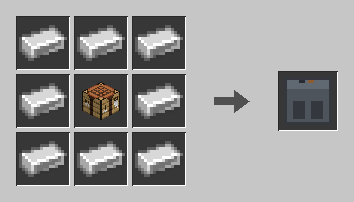
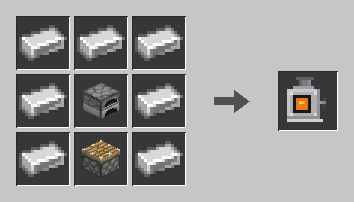

# Machine

IndustrialCraft: Evolution의 기계 모듈입니다. 연료를 소모해 **회전 동력**(토크·각속도)을 내는 엔진부터 시작합니다.

Machine 전용 제작은 **기계 제작대**에서만 가능합니다. Material 모듈이 있으면 등급별 석탄류 연료 값·태그를 그대로 활용합니다. Material이 없어도 바닐라 `#furnace_minecart_fuel`(석탄·숯)로 동작합니다.

---

## 기계 제작대 (Machine Crafting Table)


Machine 모듈 전용 3×3 제작대입니다. `machine:machine_crafting` 타입 레시피만 매칭하며, 바닐라 제작은 할 수 없습니다. 바닐라 제작대와 같이 **레시피북**(녹색 책)으로 빠른 배치가 가능합니다.

| 항목 | 값 |
|------|-----|
| 블록 | `machine:machine_crafting_table` |
| 레시피 타입 | `machine:machine_crafting` |

### 제작 (바닐라 제작대)



철괴 8개 + 제작대 → `machine:machine_crafting_table` × 1

우클릭으로 GUI를 엽니다. 레이아웃은 바닐라 제작대와 같습니다. Machine 레시피(기계 제작대·화로 엔진 등)는 월드 시작 시 레시피북에 해금됩니다.

---

## 화로 엔진 (Furnace Engine)


연료를 태워 플라이휠을 가속하고, 샤프트로 회전 동력을 출력하는 기초 엔진입니다.

| 항목 | 값 |
|------|-----|
| 블록 | `machine:furnace_engine` |
| 연료 슬롯 | 1칸 |
| 연료 태그 | `#minecraft:furnace_minecart_fuel` |
| 최대 연료 버퍼 | 32000틱 |
| 정격 토크 | 4 Nm |
| 정격 각속도 | 256 rad/s |
| 정격 출력 | 1024 W (토크 × 각속도) |

우클릭으로 GUI를 엽니다. 연료 게이지(불꽃)·현재 토크·각속도·출력을 확인할 수 있습니다.

### 제작 (기계 제작대)



철괴 7개 + 화로 + 피스톤 → `machine:furnace_engine` × 1

바닐라 제작대에서는 만들 수 없습니다.

### 사용법

1. 화로 엔진을 설치합니다. 샤프트(톱니)는 플레이어가 바라보는 방향 기준으로 옆면을 향합니다.
2. GUI에 석탄·숯 등 허용 연료를 넣습니다.
3. 연소가 시작되면 블록이 점화(`LIT`)되고, 배기구에서 연기가 나며 샤프트가 회전합니다.
4. 연료가 끊겨도 플라이휠이 서서히 감속하므로 출력이 바로 0이 되지 않습니다.

곡괭이로 캘 수 있으며, 파괴 시 내부 연료 아이템이 드롭됩니다.

### 연료 시간

용광로 연소 시간을 **화로 광차** 기준으로 환산합니다. 석탄(용광로 1600틱)이 화로 광차 3600틱에 대응합니다.

```
엔진 연소 틱 = 용광로 연소 틱 × 3600 / 1600
```

예시 (Material 연료 등급 기준, 용광로 연소 → 엔진 연소):

| 연료 | 용광로 | 화로 엔진 |
|------|--------|-----------|
| 이탄 | 400틱 | 900틱 (45초) |
| 갈탄 | 800틱 | 1800틱 (90초) |
| 아역청탄 | 1200틱 | 2700틱 (135초) |
| 숯 | 1400틱 | 3150틱 (157.5초) |
| 역청탄(석탄) | 1600틱 | 3600틱 (180초) |
| 무연탄 | 2000틱 | 4500틱 (225초) |

Material이 없으면 바닐라 석탄·숯만 사용되며, 각각의 용광로 연소 시간에 같은 비율이 적용됩니다. 현재 잔여 연료 + 추가분이 32000틱을 넘으면 새 연료를 소비하지 않습니다.

### 동력 출력

`PowerSource` 인터페이스로 토크·각속도를 제공합니다. 실제 값은 **스핀 계수**(0~1)에 비례합니다.

| 상태 | 토크 | 각속도 | 출력 |
|------|------|--------|------|
| 정지 | 0 Nm | 0 rad/s | 0 W |
| 정격(스핀 1.0) | 4 Nm | 256 rad/s | 1024 W |

- 연소 중: 스핀 계수가 틱당 +0.05 (약 1초면 정격)
- 소화 후: 스핀 계수가 틱당 −0.0125 (약 4초면 정지)
- 샤프트 시각 회전 속도도 같은 스핀 계수를 따릅니다

샤프트 네트워크·다른 기계는 `PowerSource`만 조회하면 되며, 연료·인벤토리 로직에 의존하지 않습니다.

### 시각 효과

- 점화 시 배기구에서 캠프파이어 연기 파티클
- 화로와 같은 타는 소리(`FURNACE_FIRE_CRACKLE`)
- 클라이언트 BER로 샤프트·톱니(`furnace_engine_gear`) 메시가 회전

`furnace_engine_gear`는 렌더 전용 아이템이며, 크리에이티브 탭에는 올리지 않습니다.

---

## 등록 콘텐츠

| 종류 | ID | 설명 |
|------|-----|------|
| 블록 / 아이템 | `machine:machine_crafting_table` | 기계 제작대 (기능 블록 탭) |
| 블록 / 아이템 | `machine:furnace_engine` | 화로 엔진 (기능 블록 탭) |
| 아이템 | `machine:furnace_engine_gear` | BER용 샤프트·톱니 메시 |
| 레시피 타입 | `machine:machine_crafting` | 기계 제작대 전용 shaped 레시피 |
