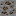
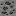
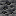

# Material

IndustrialCraft: Evolution의 연료·광물 모듈입니다. 바닐라 석탄을 **역청탄**으로 재해석하고, 등급별 석탄류를 추가합니다. 현재 콘텐츠는 **석탄 계열 연료·광석**에 한정되며, 도구·금속·주괴는 없습니다.

## 연료 등급

탄화가 진행될수록 탄소 함량이 높아지고 화력이 강해집니다. 용광로(Furnace) 연소 시간 기준(20틱 = 1초):

| | 연료 | 영문명 | 아이템 | 연소 시간 |
|---|------|--------|--------|-----------|
|  | 이탄 | Peat | `material:peat` | 400틱 (20초) |
|  | 갈탄 | Lignite | `material:lignite` | 800틱 (40초) |
|  | 아역청탄 | Sub-bituminous | `material:sub_bituminous` | 1200틱 (60초) |
|  | 숯 | Charcoal | `minecraft:charcoal` | 1400틱 (70초) |
|  | 역청탄 | Bituminous | `minecraft:coal` | 1600틱 (80초) |
|  | 무연탄 | Anthracite | `material:anthracite` | 2000틱 (100초) |

바닐라 석탄(`minecraft:coal`)은 그대로 사용하며, 표시 이름만 **역청탄**으로 바꿉니다. 숯은 바닐라 기본값(1600틱 / 80초)보다 약한 **1400틱 / 70초**로 조정됩니다.

Machine 등 다른 모듈은 용광로 연료 값을 그대로 읽고, 엔진·화로 광차는 같은 환산식으로 연소 틱을 잡습니다.

```
광차·엔진 연소 틱 = 용광로 연소 틱 × 3600 / 1600
```

상한은 **32000틱**입니다 (`FuelDurations.MAX_FUEL_TICKS`).

---

### 이탄 (Peat)


식물이 늪지에서 쌓여 부분적으로 분해된 **가장 낮은 등급**의 연료입니다. 수분·불순물이 많아 화력이 약합니다.

- 광석: `material:peat_ore` / `material:deepslate_peat_ore`
- 연소: 400틱 (20초)

### 갈탄 (Lignite)





이탄이 더 압축·탄화된 단계입니다. 갈색을 띠며 이탄보다 화력이 세지만, 여전히 저등급 석탄에 속합니다.

- 광석: `material:lignite_ore` / `material:deepslate_lignite_ore`
- 연소: 800틱 (40초)

### 아역청탄 (Sub-bituminous)





갈탄과 역청탄 사이의 중간 등급입니다. 수분과 휘발분이 줄어들며 연소 효율이 나아집니다.

- 광석: `material:sub_bituminous_ore` / `material:deepslate_sub_bituminous_ore`
- 연소: 1200틱 (60초)

### 역청탄 (Bituminous)




바닐라 **석탄**에 해당하는 표준 등급입니다. 산업·가정용으로 널리 쓰이는 전형적인 석탄입니다.

- 광석: `minecraft:coal_ore` / `minecraft:deepslate_coal_ore` (기존 바닐라; lang은 **역청탄 광석**)
- 연소: 1600틱 (80초, 바닐라 기본)

### 무연탄 (Anthracite)


탄화도가 가장 높은 **고급 석탄**입니다. 탄소 함량이 높아 오래, 세게 탑니다.

- 광석: `material:anthracite_ore` / `material:deepslate_anthracite_ore`
- 연소: 2000틱 (100초)

### 숯 (Charcoal)


나무를 무산소 환경에서 가열해 만든 **바이오매스 연료**입니다. 석탄 계열과는 생성 과정이 다르며, 이 모드에서는 역청탄보다 약간 약하게 탑니다.

- 아이템: `minecraft:charcoal` (바닐라)
- 연소: 1400틱 (70초, 모드에서 재정의)

---

## 월드 생성

바닐라 석탄 광맥(`ore_coal` / `ore_coal_buried`)을 이탄·갈탄·아역청탄·역청탄·무연탄 광맥이 섞이도록 대체합니다. 역청탄만 바닐라 석탄 광석을 사용하고, 나머지는 Material 전용 광석 블록입니다.

일반·매장형(`buried`) 모두 동일한 가중치를 사용합니다. (총합 1000)

| 연료 | weight | 비율 |
|------|--------|------|
| 이탄 | 500 | 50% |
| 갈탄 | 100 | 10% |
| 아역청탄 | 175 | 17.5% |
| 역청탄 | 200 | 20% |
| 무연탄 | 25 | 2.5% |

---

## 채굴·드롭

Material 광석은 `#minecraft:mineable/pickaxe`에 등록되어 곡괭이로 캘 수 있습니다. (티어 제한 없음)

| 조건 | 결과 |
|------|------|
| Silk Touch | 해당 광석 블록 |
| 일반 채굴 | 연료 아이템 (+ Fortune `ore_drops`) |

---

## 레시피

횃불은 `#minecraft:coals`를 쓰도록 재선언되어, Material 석탄류로도 횃불 ×4를 만들 수 있습니다.

```
X
#
```

→ `minecraft:torch` × 4 (`X`=`#minecraft:coals`, `#`=막대기)

제련·압축 등 추가 제작 레시피는 없습니다. 광석에서 연료 아이템이 드롭됩니다.

---

## 태그

| 태그 | 포함 |
|------|------|
| `#minecraft:coals` | `peat`, `lignite`, `sub_bituminous`, `anthracite` |
| `#minecraft:furnace_minecart_fuel` | 위와 동일 4종 |
| `#minecraft:coal_ores` (block / item) | Material 광석 8종 |
| `#minecraft:mineable/pickaxe` | Material 광석 8종 |

바닐라 석탄·숯은 기존 태그에 그대로 남습니다.

---

## 등록 콘텐츠

| 종류 | ID | 설명 |
|------|-----|------|
| 아이템 | `material:peat` | 이탄 (재료 탭) |
| 아이템 | `material:lignite` | 갈탄 (재료 탭) |
| 아이템 | `material:sub_bituminous` | 아역청탄 (재료 탭) |
| 아이템 | `material:anthracite` | 무연탄 (재료 탭) |
| 블록 / 아이템 | `material:peat_ore` / `deepslate_peat_ore` | 이탄 광석 (자연 블록 탭) |
| 블록 / 아이템 | `material:lignite_ore` / `deepslate_lignite_ore` | 갈탄 광석 |
| 블록 / 아이템 | `material:sub_bituminous_ore` / `deepslate_sub_bituminous_ore` | 아역청탄 광석 |
| 블록 / 아이템 | `material:anthracite_ore` / `deepslate_anthracite_ore` | 무연탄 광석 |
| (바닐라 lang) | `minecraft:coal` / `coal_ore` / `deepslate_coal_ore` | 표시명 역청탄(광석)으로 재해석 |
| (바닐라 연료) | `minecraft:charcoal` | 연소 1400틱으로 재정의 |
