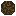
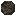
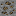
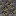
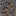
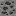
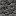
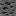

# Material

IndustrialCraft: Evolution의 연료·광물 모듈입니다. 바닐라 `minecraft:coal`을 **역청탄**으로 재해석하고, 등급별 연료 계열을 추가합니다. 현재 콘텐츠는 **석탄 계열 연료·광석·압축 블록**에 한정되며, 도구·금속·주괴는 없습니다.

## 연료 등급

탄화가 진행될수록 탄소 함량이 높아지고 화력이 강해집니다. 용광로(Furnace) 연소 시간 기준(20틱 = 1초):

| | 연료 | 영문명 | 아이템 | 연소 시간 |
|---|------|--------|--------|-----------|
|  | 이탄 | Peat | `material:peat` | 400틱 (20초) |
|  | 갈탄 | Lignite | `material:lignite` | 800틱 (40초) |
|  | 아역청탄 | Sub-bituminous | `material:sub_bituminous` | 1200틱 (60초) |
|  | 숯 | Charcoal | `minecraft:charcoal` | 1440틱 (72초, 역청탄의 90%) |
|  | 역청탄 | Bituminous | `minecraft:coal` | 1600틱 (80초) |
|  | 무연탄 | Anthracite | `material:anthracite` | 2000틱 (100초, 역청탄의 125%) |

바닐라 `minecraft:coal`은 그대로 사용하며, 표시 이름만 **역청탄**으로 바꿉니다. 숯은 역청탄의 **90%**(1440틱)입니다. 계열 효율: 이탄 25% · 갈탄 50% · 아역청탄 75% · 역청탄 100% · 무연탄 125%. 각 계열 연료 ×9 = 해당 압축 블록(연소는 낱개의 10배, 화로 광차 불가).

Machine 등 다른 모듈은 용광로 연료 값을 그대로 읽고, 엔진·화로 광차는 같은 환산식으로 연소 틱을 잡습니다.

```
광차·엔진 연소 틱 = 용광로 연소 틱 × 3600 / 1600
```

상한은 **32000틱**입니다 (`FuelDurations.MAX_FUEL_TICKS`).

---

### 이탄 (Peat)





식물이 늪지에서 쌓여 부분적으로 분해된 **가장 낮은 등급**의 연료입니다. 수분·불순물이 많아 화력이 약합니다.

- 광석: `material:peat_ore` / `material:deepslate_peat_ore`
- 연소: 400틱 (20초)

### 갈탄 (Lignite)




이탄이 더 압축·탄화된 단계입니다. 갈색을 띠며 이탄보다 화력이 세지만, 여전히 저등급 연료에 속합니다.

- 광석: `material:lignite_ore` / `material:deepslate_lignite_ore`
- 연소: 800틱 (40초)

### 아역청탄 (Sub-bituminous)





갈탄과 역청탄 사이의 중간 등급입니다. 수분과 휘발분이 줄어들며 연소 효율이 나아집니다.

- 광석: `material:sub_bituminous_ore` / `material:deepslate_sub_bituminous_ore`
- 연소: 1200틱 (60초)

### 역청탄 (Bituminous)


바닐라 `minecraft:coal`에 해당하는 표준 등급입니다. 산업·가정용으로 널리 쓰이는 전형적인 **역청탄**입니다.

- 광석: `minecraft:coal_ore` / `minecraft:deepslate_coal_ore` (기존 바닐라; lang은 **역청탄 광석**)
- 연소: 1600틱 (80초, 바닐라 기본)

### 무연탄 (Anthracite)




탄화도가 가장 높은 **고급 연료**입니다. 탄소 함량이 높아 오래, 세게 탑니다.

- 광석: `material:anthracite_ore` / `material:deepslate_anthracite_ore`
- 연소: 2000틱 (100초)

### 숯 (Charcoal)


나무를 무산소 환경에서 가열해 만든 **바이오매스 연료**입니다. 석탄 계열 등급에는 속하지 않으며, 이 모드에서는 역청탄의 **90%**로 탑니다.

- 아이템: `minecraft:charcoal` (바닐라)
- 연소: 1440틱 (72초, 모드에서 재정의)

---

## 월드 생성

바닐라 역청탄 광맥(`ore_coal` / `ore_coal_buried`)을 유지한 채, 광맥 **블록을 놓을 때마다** 이탄·갈탄·아역청탄·역청탄·무연탄을 가중치로 굴려 혼합합니다. (계열별 단독 광맥 금지) 역청탄만 바닐라 역청탄 광석을 쓰고, 나머지는 Material 전용 광석입니다.

일반·매장형(`buried`) 모두 동일한 가중치를 사용합니다. (총합 1000)

| 연료 | weight | 비율 |
|------|--------|------|
| 이탄 | 500 | 50% |
| 갈탄 | 100 | 10% |
| 아역청탄 | 175 | 17.5% |
| 역청탄 | 200 | 20% |
| 무연탄 | 25 | 2.5% |

---

## 채굴·드롭

Material 광석·압축 블록은 `#minecraft:mineable/pickaxe`에 등록되어 곡괭이로 캘 수 있습니다. (바닐라 역청탄 광석과 같이 티어 제한 없음)

| 조건 | 결과 |
|------|------|
| Silk Touch | 해당 광석 블록 |
| 일반 채굴 | 연료 아이템 (+ Fortune `ore_drops`) |

---

## 레시피

횃불은 `#minecraft:coals`를 쓰도록 재선언되어, Material 연료로도 횃불 ×4를 만들 수 있습니다. 윗칸 연료 + 막대기 → 횃불 ×4. 영혼 횃불·캠프파이어 등 `#coals`를 쓰는 바닐라 레시피도 동일하게 해금됩니다.

<table>
<tr>
<td align="center">

**이탄**

| | | |
|:---:|:---:|:---:|
| |  | |
| |  | |

→  × 4

</td>
<td align="center">

**갈탄**

| | | |
|:---:|:---:|:---:|
| |  | |
| |  | |

→  × 4

</td>
<td align="center">

**아역청탄**

| | | |
|:---:|:---:|:---:|
| |  | |
| |  | |

→  × 4

</td>
<td align="center">

**역청탄**

| | | |
|:---:|:---:|:---:|
| |  | |
| |  | |

→  × 4

</td>
<td align="center">

**무연탄**

| | | |
|:---:|:---:|:---:|
| |  | |
| |  | |

→  × 4

</td>
</tr>
</table>

숯(`minecraft:charcoal`)도 `#minecraft:coals`에 포함되므로 동일하게 제작됩니다.

### 압축 블록


각 계열 연료 ×9 ⇄ 해당 계열 압축 블록 ×1 (양방향). 재료는 `#material:{rank}` / `#material:{rank}_blocks` 태그를 씁니다. 역청탄 블록은 바닐라 유지(역청탄만). 레시피 핸드북 해금용 advancement가 `advancement/recipes/building/`에 있습니다.

| 조합 | 결과 |
|------|------|
| 이탄 ×9 | `material:peat_block` (4000틱) |
| 갈탄 ×9 | `material:lignite_block` (8000틱) |
| 아역청탄 ×9 | `material:sub_bituminous_block` (12000틱) |
| 역청탄 ×9 | `minecraft:coal_block` (16000틱, 바닐라) |
| 무연탄 ×9 | `material:anthracite_block` (20000틱) |

압축 블록은 용광로 연료이며 화로 광차에는 넣을 수 없습니다. 일반 채굴 시 광석에서 연료 아이템이 드롭됩니다.

### 광석 제련

실크터치로 캔 광석·심층 광석은 바닐라 역청탄 광석처럼 용광로·고로에서 해당 계열 연료로 제련됩니다. (훈연기 불가. XP 0.1 · 용광로 200틱 · 고로 100틱)

| 입력 | 결과 |
|------|------|
| `peat_ore` / `deepslate_peat_ore` | `material:peat` |
| `lignite_ore` / `deepslate_lignite_ore` | `material:lignite` |
| `sub_bituminous_ore` / `deepslate_sub_bituminous_ore` | `material:sub_bituminous` |
| `coal_ore` / `deepslate_coal_ore` | `minecraft:coal` (바닐라) |
| `anthracite_ore` / `deepslate_anthracite_ore` | `material:anthracite` |

레시피 ID는 `{rank}_from_smelting_{ore}` / `{rank}_from_blasting_{ore}` 형태이며, 핸드북 해금 advancement는 `advancement/recipes/misc/`에 있습니다.

---

## 태그

| 태그 | 포함 |
|------|------|
| `#minecraft:coals` | `peat`, `lignite`, `sub_bituminous`, `anthracite` |
| `#minecraft:furnace_minecart_fuel` | 위와 동일 4종 |
| `#minecraft:coal_ores` (block / item) | Material 광석 8종 |
| `#minecraft:mineable/pickaxe` | Material 광석 8종 + 압축 블록 4종 |

바닐라 역청탄·숯은 기존 태그에 그대로 남습니다.

---

## 크리에이티브 탭

전용 탭 (`IndustrialCraft: …`):

| 탭 | 내용 |
|----|------|
| Building Blocks | 이탄·갈탄·아역청탄·역청탄·무연탄 압축 블록 |
| Ingredients | 이탄·갈탄·아역청탄·역청탄·숯·무연탄 |
| Natural Blocks | Material 광석 8종 + 바닐라 역청탄 광석·심층 광석 |

---

## 등록 콘텐츠

| 종류 | ID | 설명 |
|------|-----|------|
| 아이템 | `material:peat` | 이탄 (Ingredients) |
| 아이템 | `material:lignite` | 갈탄 (Ingredients) |
| 아이템 | `material:sub_bituminous` | 아역청탄 (Ingredients) |
| 아이템 | `material:anthracite` | 무연탄 (Ingredients) |
| 블록 | `material:peat_block` 등 4종 | 계열 압축 블록 (Building Blocks) |
| 블록 | `material:peat_ore` / `deepslate_peat_ore` 등 8종 | 계열 광석 (Natural Blocks) |
| (바닐라 lang) | `minecraft:coal` / `coal_ore` / `deepslate_coal_ore` / `coal_block` | 표시명 역청탄 계열로 재해석 |
| (바닐라 연료) | `minecraft:charcoal` | 연소 1440틱으로 재정의 |

---

## 검증 (§ project-common 5·7)

| 구분 | 명령 / 도구 | CI (Actions) |
|------|-------------|--------------|
| 서버 GameTest | `./gradlew :Material:runGameTest` (`check`/`build`에 포함) | ✅ |
| Client GameTest | `./gradlew :Material:runClientGameTest` | ❌ 로컬 전용 |
| 모델 렌더·시각 검수 | `tools/Render-McModel.ps1`, `tools/Render-BlockIso.ps1` | ❌ 로컬 전용 |

모델·텍스처를 바꾼 뒤에는 로컬에서 렌더/인게임으로 보이고(`assets/.../textures`가 기준), 서버 GameTest의 불투명 블록면·parent 규칙 검사로 회귀를 막습니다. Client GameTest·렌더 스크립트는 Actions에 넣지 않습니다.
